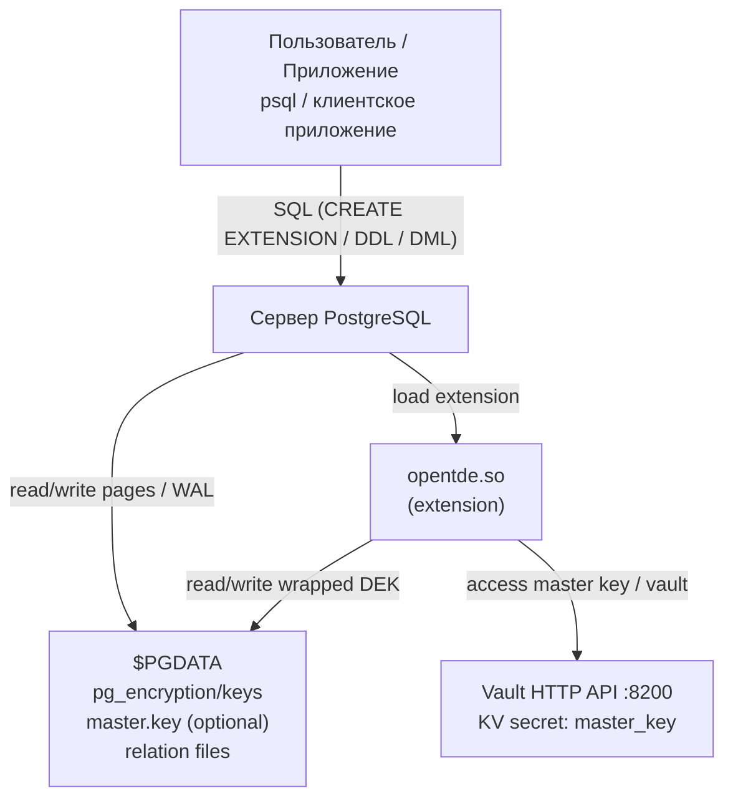

# OpenTDE (PostgreSQL extension) — diagrams

## Deployment (Mermaid)

> Примечание: `deploymentDiagram` поддерживается не всеми Mermaid-рендерерами.
> Ниже — эквивалентная схема на `flowchart`, которая обычно работает везде (GitHub, VS Code).

